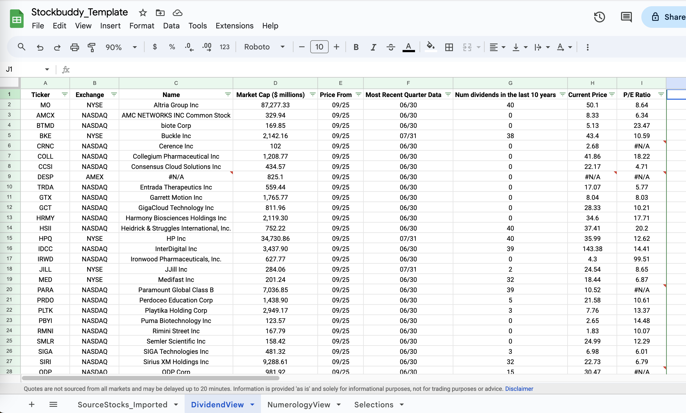

# Stockbuddy

This repository contains code and artifacts I use for security selection as part of the magic formula investment strategy described in Joel Greenblatt's book The Little Book That Beats The Market.

Magic stocks generated using the free screener provided at 
https://www.magicformulainvesting.com/Screening/StockScreening

Criteria used:
Market cap > $100 million
Number of stocks: 30

Stockbuddy converts the html table into a csv with an added column for number of dividend payouts in the last 10 years

This csv file is then imported into a Google Sheet template called Stockbuddy_Template.

### To use the Stockbuddy Template
1. Make a copy of the template
2. Use the view of your choice to select stocks
3. Make your selections by checking the box against the ticker.
4. Use the column filter to view only your selections
5. Buy these stocks and setup reminders 1 year from now
    - Taxable accounts: Setup a week long event from 2 days before the purchase date to 2 days after so that you can optimize for taxes
    - Tax-sheltered account: the distinction between short-term and long-term gains does not matter, a single reminder day is sufficient

### Source List Update Schedule
The SourceStocks are updated approx every 3 months
